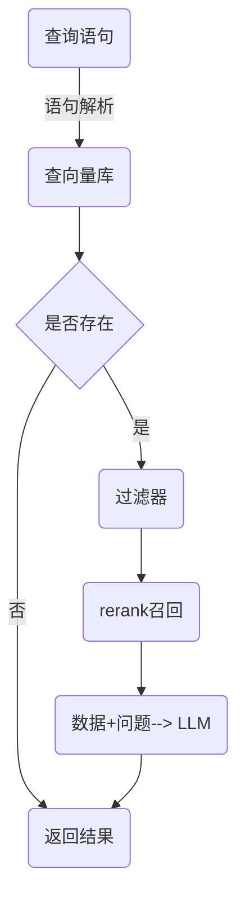

# MemoMate

### 查询同类型问题/事故


```mermaid

flowchart TD
    A(查询语句) -->|语句解析| B(查向量库)
    B --> C{是否存在}
    C -->|否| D(返回结果)
    C -->|是| E(过滤器)
    E --> G(rerank召回)
    G --> F(数据+问题--> LLM)
    F --> D
```
### 配置环境

```bash
uv venv -p 3.12
uv sync
```

### 下载bge

```bash
huggingface-cli download BAAI/bge-large-zh-v1.5 --local-dir ./bge-large-zh-v1.5
```