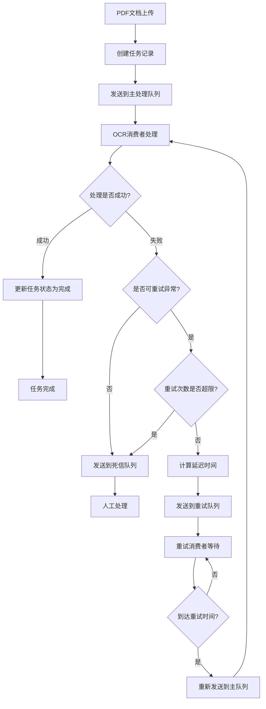

```mermaid
graph TD
    A[PDF文档上传] --> B[创建任务记录]
    B --> C[发送到主处理队列]
    C --> D[OCR消费者处理]
    D --> E{处理是否成功?}
    E -->|成功| F[更新任务状态为完成]
    E -->|失败| G{是否可重试异常?}
    G -->|否| H[发送到死信队列]
    G -->|是| I{重试次数是否超限?}
    I -->|是| H
    I -->|否| J[计算延迟时间]
    J --> K[发送到重试队列]
    K --> L[重试消费者等待]
    L --> M{到达重试时间?}
    M -->|否| L
    M -->|是| N[重新发送到主队列]
    N --> D
    F --> O[任务完成]
    H --> P[人工处理]
```
