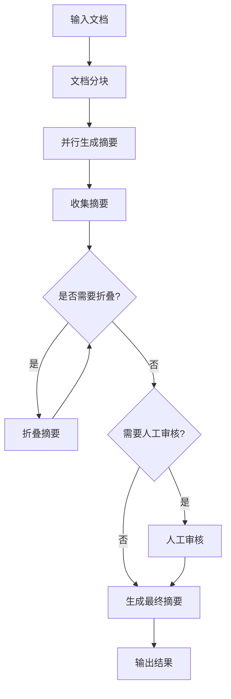

# Web搜索和文档处理优化

## 概述

本项目对 `app/utils/web_search.py` 模块进行了全面优化，实现了一个功能强大、可扩展的文档处理和摘要生成系统。该系统基于 LangGraph 的 Map-Reduce 模式，支持多种文档格式、总结策略和高级配置选项。

## 主要特性

### 🚀 核心功能

- **多策略摘要生成**: 支持简洁、详细、要点、技术四种不同的摘要策略
- **多文档格式支持**: 支持Web页面、PDF、Word、文本、Markdown、CSV、JSON等格式
- **自动递归折叠**: 智能处理超长文档，自动折叠中间结果
- **流式处理**: 实时监控处理步骤，支持进度跟踪
- **人工审核节点**: 可选的人工审核流程，确保摘要质量
- **缓存和检查点**: 支持处理结果缓存，提高效率
- **完整的错误处理**: 健壮的异常处理和状态管理

### 📊 架构优势

- **策略模式**: 使用抽象基类实现不同的摘要策略，易于扩展
- **工厂模式**: 文档加载器工厂，统一管理不同格式的加载器
- **配置驱动**: 通过 Pydantic 模型管理配置，类型安全
- **异步处理**: 全异步设计，支持高并发处理
- **模块化设计**: 清晰的职责分离，便于维护和测试

## 使用指南

### 基础使用

```python
from app.utils.web_search import (
    ProcessingConfig,
    SummaryStrategy,
    summarize_text_list
)

# 简单文本摘要
texts = ["文本内容1", "文本内容2"]
summary = await summarize_text_list(texts, SummaryStrategy.CONCISE)
print(summary)
```

### 高级配置

```python
from app.utils.web_search import WebSearchProcessor, ProcessingConfig

# 创建自定义配置
config = ProcessingConfig(
    token_max=2000,
    chunk_size=800,
    enable_human_review=True,
    enable_cache=True
)

# 使用处理器
processor = WebSearchProcessor(config)
result = await processor.process_documents(
    texts,
    strategy=SummaryStrategy.TECHNICAL
)
```

### 网页内容处理

```python
from app.utils.web_search import summarize_web_content

# 处理网页内容
summary = await summarize_web_content(
    "https://example.com",
    SummaryStrategy.DETAILED
)
```

### 不同文档格式

```python
from app.utils.web_search import summarize_document, DocumentFormat

# 处理PDF文档
summary = await summarize_document(
    "document.pdf",
    DocumentFormat.PDF,
    SummaryStrategy.TECHNICAL
)
```

## 配置选项

### ProcessingConfig 参数

| 参数 | 类型 | 默认值 | 说明 |
|------|------|--------|------|
| `token_max` | int | 3000 | 最大token限制 |
| `chunk_size` | int | 1000 | 文档分块大小 |
| `chunk_overlap` | int | 200 | 分块重叠大小 |
| `temperature` | float | 0 | LLM温度参数 |
| `recursion_limit` | int | 10 | 递归限制 |
| `enable_cache` | bool | True | 是否启用缓存 |
| `enable_human_review` | bool | False | 是否需要人工审核 |

### 摘要策略

| 策略 | 描述 | 适用场景 |
|------|------|----------|
| `CONCISE` | 简洁摘要 | 快速概览，突出核心要点 |
| `DETAILED` | 详细摘要 | 保留重要细节和背景信息 |
| `BULLET_POINTS` | 要点摘要 | 结构化列表，便于阅读 |
| `TECHNICAL` | 技术摘要 | 技术文档，保留技术细节 |

### 支持的文档格式

| 格式 | 扩展名 | 加载器 |
|------|--------|---------|
| Web | URL | WebBaseLoader |
| PDF | .pdf | PyPDFLoader |
| Word | .docx | Docx2txtLoader |
| 文本 | .txt | TextLoader |
| Markdown | .md | UnstructuredMarkdownLoader |
| CSV | .csv | CSVLoader |
| JSON | .json | JSONLoader |

## 处理流程

### Map-Reduce 架构



### 处理节点

1. **generate_summary**: 并行生成单个文档块的摘要
2. **collect_summaries**: 收集所有摘要并转换为Document对象
3. **collapse_summaries**: 当摘要过长时进行递归折叠
4. **human_review**: 可选的人工审核节点
5. **generate_final_summary**: 生成最终的综合摘要

## 错误处理

系统提供了完善的错误处理机制：

- **LLM初始化失败**: 自动记录错误并抛出异常
- **Token计算失败**: 使用fallback估算方法
- **摘要生成失败**: 返回错误信息而不是崩溃
- **文档加载失败**: 详细的错误日志和异常处理
- **网络连接问题**: 自动重试和降级处理

## 性能优化

### 并发处理

- 使用异步编程模型，支持高并发
- Map阶段并行处理多个文档块
- 智能的token管理和内存使用

### 缓存机制

- 支持处理结果缓存，避免重复计算
- LangGraph检查点功能，支持中断恢复
- 配置驱动的缓存策略

### 资源管理

- 智能的token限制管理
- 自适应的文档分块策略
- 内存友好的流式处理

## 测试覆盖

项目包含全面的测试套件：

- **单元测试**: 覆盖所有核心组件
- **集成测试**: 测试完整的处理流程
- **错误处理测试**: 验证异常情况的处理
- **性能测试**: 确保处理效率

运行测试：

```bash
# 运行所有测试
uv run pytest app/tests/utils/test_web_search.py -v

# 运行特定测试类
uv run pytest app/tests/utils/test_web_search.py::TestProcessingConfig -v
```

## 示例代码

详细的使用示例请参考 `app/utils/web_search_examples.py` 文件，包含：

1. 基础文本总结
2. 不同策略对比
3. 自定义配置使用
4. 网页内容总结
5. 批量处理
6. 错误处理和恢复

## 扩展指南

### 添加新的摘要策略

```python
class CustomStrategy(PromptTemplateStrategy):
    """自定义摘要策略"""

    def get_map_template(self) -> str:
        return "自定义的Map阶段提示模板: {context}"

    def get_reduce_template(self) -> str:
        return "自定义的Reduce阶段提示模板: {docs}"

# 在WebSearchProcessor中注册
processor.strategy_map[SummaryStrategy.CUSTOM] = CustomStrategy()
```

### 添加新的文档格式

```python
# 在DocumentLoaderFactory中添加
loaders[DocumentFormat.NEW_FORMAT] = lambda: NewFormatLoader(str(source))
```

### 自定义处理节点

```python
async def custom_processing_node(state: OverallState) -> dict:
    """自定义处理节点"""
    # 实现自定义逻辑
    return {"custom_result": "processed"}

# 在图中添加节点
graph.add_node("custom_node", custom_processing_node)
```

## 最佳实践

1. **配置管理**: 根据文档类型和需求选择合适的配置
2. **策略选择**: 根据使用场景选择最适合的摘要策略
3. **错误处理**: 始终使用try-catch包装处理逻辑
4. **性能监控**: 利用日志和元数据监控处理性能
5. **资源控制**: 合理设置token限制和并发数量

## 依赖要求

```toml
# pyproject.toml 中的主要依赖
langchain = "^0.1.0"
langchain-community = "^0.1.0"
langchain-core = "^0.1.0"
langgraph = "^0.1.0"
pydantic = "^2.0.0"
```

## 日志配置

系统使用项目统一的日志适配器：

```python
from app.core.log_adapter import logger

# 日志使用示例
logger.info("处理开始", document_count=5)
logger.exception("处理失败", exc_info=e)
```

## 故障排除

### 常见问题

1. **LLM连接失败**: 检查API密钥和网络连接
2. **内存不足**: 减少chunk_size或token_max
3. **处理超时**: 增加recursion_limit或优化文档大小
4. **摘要质量差**: 尝试不同的策略或调整temperature

### 调试技巧

- 启用详细日志记录
- 使用小数据集测试
- 检查配置参数合理性
- 监控处理步骤和元数据

## 更新日志

### v2.0.0 (当前版本)

- ✨ 全面重构，采用面向对象设计
- ✨ 新增四种摘要策略
- ✨ 支持多种文档格式
- ✨ 添加人工审核节点
- ✨ 完善的错误处理和日志记录
- ✨ 全面的测试覆盖
- 🐛 修复token计算问题
- 🔧 优化性能和内存使用

### v1.0.0 (原版本)

- 基础的Map-Reduce文档处理
- 简单的网页内容总结
- 基本的错误处理

## 贡献指南

欢迎贡献代码！请遵循以下步骤：

1. Fork 项目
2. 创建功能分支
3. 编写测试用例
4. 确保所有测试通过
5. 提交 Pull Request

## 许可证

本项目采用 MIT 许可证。详情请参阅 LICENSE 文件。
